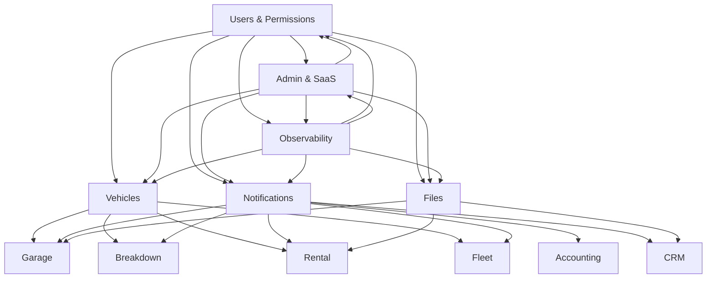

# DriveOps - Complete Architecture Summary

This document provides a comprehensive overview of the DriveOps platform architecture, covering all modules, technology stack, database design, and implementation patterns.

---

## 1. Complete Module Overview

### 1.1 Core Modules (Always Present)

#### Module 1: Users & Permissions
- **Purpose**: User management, authentication, and authorization
- **Key Features**: 
  - Multi-tenant user management with tenant isolation
  - Keycloak integration for SSO and RBAC
  - Role-based permissions matrix
  - User profile management and preferences
- **Dependencies**: Keycloak, PostgreSQL
- **Communication**: gRPC services, MediatR commands/queries

#### Module 2: Vehicles
- **Purpose**: Vehicle information management and tracking
- **Key Features**:
  - Vehicle registration and fleet management
  - Global vehicle brands/models reference data
  - Maintenance history and scheduling
  - Vehicle status tracking and location services
- **Dependencies**: Files module (for documents), Users module
- **Communication**: gRPC services, event-driven updates

#### Module 3: Notifications
- **Purpose**: Multi-channel notification system
- **Key Features**:
  - Email, SMS, push notifications
  - Real-time in-app notifications
  - Notification templates and preferences
  - Delivery tracking and retry mechanisms
- **Dependencies**: Users module, message queue (RabbitMQ)
- **Communication**: Event-driven, asynchronous messaging

#### Module 4: Files
- **Purpose**: Centralized file storage and management
- **Key Features**:
  - MongoDB GridFS for primary storage
  - MinIO for secondary/archive storage
  - File size-based routing and optimization
  - Virus scanning and metadata extraction
- **Dependencies**: MongoDB, MinIO, antivirus services
- **Communication**: REST API, gRPC for metadata

#### Module 5: Admin & SaaS Management
- **Purpose**: Multi-tenant platform administration
- **Key Features**:
  - Tenant provisioning and management
  - Subscription and billing management
  - Deployment automation (Docker/Kubernetes)
  - Support ticket system
- **Dependencies**: All modules, Kubernetes, PostgreSQL
- **Communication**: Blazor Server UI, gRPC services

#### Module 6: Observability & Monitoring
- **Purpose**: System monitoring and observability
- **Key Features**:
  - Metrics collection (Prometheus/InfluxDB)
  - Centralized logging (Elasticsearch/MongoDB)
  - Alert management with notifications
  - Health checks and real-time dashboards
- **Dependencies**: Prometheus, Grafana, Elasticsearch
- **Communication**: SignalR for real-time updates

### 1.2 Business Modules (Pay-per-Use)

#### Garage Module
- **Purpose**: Automotive repair shop management
- **Key Features**: Work orders, parts inventory, labor tracking, invoicing
- **Dependencies**: Vehicles, Users, Files, Notifications modules

#### Breakdown Module
- **Purpose**: Roadside assistance and emergency services
- **Key Features**: Emergency dispatch, GPS tracking, mobile workforce management
- **Dependencies**: Vehicles, Users, Notifications, geolocation services

#### Rental Module
- **Purpose**: Vehicle rental and fleet management
- **Key Features**: Reservations, contracts, availability management, pricing
- **Dependencies**: Vehicles, Users, Files, billing integration

#### Fleet Module
- **Purpose**: Enterprise fleet management
- **Key Features**: Fleet tracking, maintenance scheduling, compliance reporting
- **Dependencies**: Vehicles, Users, Notifications, IoT integrations

#### Accounting Module
- **Purpose**: Financial management and reporting
- **Key Features**: Chart of accounts, journal entries, financial statements
- **Dependencies**: All business modules, external accounting systems

#### CRM Module
- **Purpose**: Customer relationship management
- **Key Features**: Contact management, sales pipeline, marketing automation
- **Dependencies**: Users, Notifications, Files modules

### 1.3 Module Dependencies and Interactions



---

## 2. gRPC Communication Patterns

### 2.1 Service Definitions

```protobuf
// users.proto
syntax = "proto3";

package driveops.users.v1;

service UserService {
  rpc GetUser(GetUserRequest) returns (GetUserResponse);
  rpc CreateUser(CreateUserRequest) returns (CreateUserResponse);
  rpc UpdateUser(UpdateUserRequest) returns (UpdateUserResponse);
  rpc ValidatePermissions(ValidatePermissionsRequest) returns (ValidatePermissionsResponse);
  rpc GetUsersByTenant(GetUsersByTenantRequest) returns (GetUsersByTenantResponse);
}

message GetUserRequest {
  string user_id = 1;
  string tenant_id = 2;
}

message GetUserResponse {
  User user = 1;
  repeated string roles = 2;
  repeated Permission permissions = 3;
}

message User {
  string id = 1;
  string tenant_id = 2;
  string email = 3;
  string first_name = 4;
  string last_name = 5;
  string phone = 6;
  bool is_active = 7;
  google.protobuf.Timestamp created_at = 8;
  google.protobuf.Timestamp updated_at = 9;
}

// vehicles.proto
syntax = "proto3";

package driveops.vehicles.v1;

service VehicleService {
  rpc GetVehicle(GetVehicleRequest) returns (GetVehicleResponse);
  rpc CreateVehicle(CreateVehicleRequest) returns (CreateVehicleResponse);
  rpc UpdateVehicle(UpdateVehicleRequest) returns (UpdateVehicleResponse);
  rpc GetVehiclesByTenant(GetVehiclesByTenantRequest) returns (GetVehiclesByTenantResponse);
  rpc GetVehicleBrands(GetVehicleBrandsRequest) returns (GetVehicleBrandsResponse);
}

message Vehicle {
  string id = 1;
  string tenant_id = 2;
  string vin = 3;
  string license_plate = 4;
  int32 brand_id = 5;
  string model = 6;
  int32 year = 7;
  string color = 8;
  VehicleStatus status = 9;
  int32 mileage = 10;
  string owner_id = 11;
  google.protobuf.Timestamp created_at = 12;
  google.protobuf.Timestamp updated_at = 13;
}

// notifications.proto
syntax = "proto3";

package driveops.notifications.v1;

service NotificationService {
  rpc SendNotification(SendNotificationRequest) returns (SendNotificationResponse);
  rpc SendBulkNotifications(SendBulkNotificationsRequest) returns (SendBulkNotificationsResponse);
  rpc GetNotificationHistory(GetNotificationHistoryRequest) returns (GetNotificationHistoryResponse);
  rpc UpdateDeliveryStatus(UpdateDeliveryStatusRequest) returns (UpdateDeliveryStatusResponse);
}

message SendNotificationRequest {
  string tenant_id = 1;
  repeated string recipient_ids = 2;
  NotificationType type = 3;
  string template_id = 4;
  map<string, string> variables = 5;
  NotificationChannel channel = 6;
  int32 priority = 7;
}

// files.proto
syntax = "proto3";

package driveops.files.v1;

service FileService {
  rpc UploadFile(stream UploadFileRequest) returns (UploadFileResponse);
  rpc DownloadFile(DownloadFileRequest) returns (stream DownloadFileResponse);
  rpc GetFileMetadata(GetFileMetadataRequest) returns (GetFileMetadataResponse);
  rpc DeleteFile(DeleteFileRequest) returns (DeleteFileResponse);
  rpc GetFilesByEntity(GetFilesByEntityRequest) returns (GetFilesByEntityResponse);
}

message FileMetadata {
  string id = 1;
  string tenant_id = 2;
  string filename = 3;
  string content_type = 4;
  int64 size = 5;
  string hash = 6;
  StorageLocation storage_location = 7;
  string entity_type = 8;
  string entity_id = 9;
  map<string, string> metadata = 10;
  google.protobuf.Timestamp created_at = 11;
}
```

### 2.2 Service Communication Patterns

```csharp
namespace DriveOps.Common.Communication
{
    // Service discovery and client factory
    public interface IGrpcClientFactory
    {
        TClient CreateClient<TClient>(string serviceName) where TClient : class;
    }

    public class GrpcClientFactory : IGrpcClientFactory
    {
        private readonly IServiceDiscovery _serviceDiscovery;
        private readonly IConfiguration _configuration;

        public TClient CreateClient<TClient>(string serviceName) where TClient : class
        {
            var serviceEndpoint = _serviceDiscovery.GetServiceEndpoint(serviceName);
            var channel = GrpcChannel.ForAddress(serviceEndpoint.Uri, new GrpcChannelOptions
            {
                Credentials = ChannelCredentials.SecureSsl,
                ServiceConfig = new ServiceConfig
                {
                    MethodConfigs = { GetRetryPolicy() }
                }
            });

            return (TClient)Activator.CreateInstance(typeof(TClient), channel);
        }

        private MethodConfig GetRetryPolicy()
        {
            return new MethodConfig
            {
                Names = { MethodName.Default },
                RetryPolicy = new RetryPolicy
                {
                    MaxAttempts = 3,
                    InitialBackoff = TimeSpan.FromMilliseconds(500),
                    MaxBackoff = TimeSpan.FromSeconds(5),
                    BackoffMultiplier = 2,
                    RetryableStatusCodes = { StatusCode.Unavailable, StatusCode.DeadlineExceeded }
                }
            };
        }
    }

    // Cross-module service calls with circuit breaker
    public class VehicleServiceClient
    {
        private readonly VehicleService.VehicleServiceClient _client;
        private readonly ICircuitBreaker _circuitBreaker;
        private readonly ILogger<VehicleServiceClient> _logger;

        public async Task<Vehicle> GetVehicleAsync(string vehicleId, string tenantId)
        {
            return await _circuitBreaker.ExecuteAsync(async () =>
            {
                var request = new GetVehicleRequest
                {
                    VehicleId = vehicleId,
                    TenantId = tenantId
                };

                var response = await _client.GetVehicleAsync(request);
                return response.Vehicle;
            });
        }

        public async Task<List<Vehicle>> GetVehiclesByTenantAsync(string tenantId, int page = 1, int pageSize = 50)
        {
            return await _circuitBreaker.ExecuteAsync(async () =>
            {
                var request = new GetVehiclesByTenantRequest
                {
                    TenantId = tenantId,
                    Page = page,
                    PageSize = pageSize
                };

                var response = await _client.GetVehiclesByTenantAsync(request);
                return response.Vehicles.ToList();
            });
        }
    }
}
```

---

## 3. MediatR + CQRS Implementation

### 3.1 Command and Query Structure

```csharp
namespace DriveOps.Common.CQRS
{
    // Base command and query interfaces
    public interface ICommand : IRequest<Result>
    {
        string TenantId { get; }
        string UserId { get; }
        string CorrelationId { get; }
    }

    public interface ICommand<TResponse> : IRequest<Result<TResponse>>
    {
        string TenantId { get; }
        string UserId { get; }
        string CorrelationId { get; }
    }

    public interface IQuery<TResponse> : IRequest<Result<TResponse>>
    {
        string TenantId { get; }
        string UserId { get; }
    }

    // Base command handler with tenant validation
    public abstract class BaseCommandHandler<TCommand> : IRequestHandler<TCommand, Result>
        where TCommand : ICommand
    {
        protected readonly ITenantContext TenantContext;
        protected readonly ILogger Logger;
        protected readonly IUnitOfWork UnitOfWork;

        protected BaseCommandHandler(
            ITenantContext tenantContext,
            ILogger logger,
            IUnitOfWork unitOfWork)
        {
            TenantContext = tenantContext;
            Logger = logger;
            UnitOfWork = unitOfWork;
        }

        public async Task<Result> Handle(TCommand request, CancellationToken cancellationToken)
        {
            // Validate tenant access
            if (!await ValidateTenantAccessAsync(request.TenantId, request.UserId))
            {
                return Result.Failure("Unauthorized tenant access");
            }

            try
            {
                var result = await HandleCommandAsync(request, cancellationToken);
                
                if (result.IsSuccess)
                {
                    await UnitOfWork.SaveChangesAsync(cancellationToken);
                }

                return result;
            }
            catch (Exception ex)
            {
                Logger.LogError(ex, "Error handling command {CommandType}", typeof(TCommand).Name);
                return Result.Failure($"Command failed: {ex.Message}");
            }
        }

        protected abstract Task<Result> HandleCommandAsync(TCommand request, CancellationToken cancellationToken);
        
        protected virtual async Task<bool> ValidateTenantAccessAsync(string tenantId, string userId)
        {
            return await TenantContext.ValidateUserAccessAsync(tenantId, userId);
        }
    }

    // Example command implementation
    public record CreateVehicleCommand(
        string TenantId,
        string UserId,
        string CorrelationId,
        string Vin,
        string LicensePlate,
        int BrandId,
        string Model,
        int Year,
        string Color,
        string OwnerId
    ) : ICommand<Guid>;

    public class CreateVehicleCommandHandler : BaseCommandHandler<CreateVehicleCommand, Result<Guid>>
    {
        private readonly IVehicleRepository _vehicleRepository;
        private readonly IVehicleBrandRepository _brandRepository;
        private readonly IDomainEventDispatcher _eventDispatcher;

        public CreateVehicleCommandHandler(
            ITenantContext tenantContext,
            ILogger<CreateVehicleCommandHandler> logger,
            IUnitOfWork unitOfWork,
            IVehicleRepository vehicleRepository,
            IVehicleBrandRepository brandRepository,
            IDomainEventDispatcher eventDispatcher)
            : base(tenantContext, logger, unitOfWork)
        {
            _vehicleRepository = vehicleRepository;
            _brandRepository = brandRepository;
            _eventDispatcher = eventDispatcher;
        }

        protected override async Task<Result<Guid>> HandleCommandAsync(
            CreateVehicleCommand request, 
            CancellationToken cancellationToken)
        {
            // Validate VIN uniqueness within tenant
            if (await _vehicleRepository.VinExistsInTenantAsync(request.Vin, request.TenantId))
            {
                return Result.Failure<Guid>("VIN already exists in this tenant");
            }

            // Validate brand exists
            var brand = await _brandRepository.GetByIdAsync(request.BrandId);
            if (brand == null)
            {
                return Result.Failure<Guid>("Invalid brand ID");
            }

            // Create vehicle
            var vehicle = new Vehicle(
                TenantId.From(Guid.Parse(request.TenantId)),
                request.Vin,
                request.LicensePlate,
                brand.Id,
                request.Model,
                request.Year,
                request.Color,
                UserId.From(Guid.Parse(request.OwnerId))
            );

            await _vehicleRepository.AddAsync(vehicle);

            // Dispatch domain events
            await _eventDispatcher.DispatchAsync(vehicle.DomainEvents, cancellationToken);

            return Result.Success(vehicle.Id.Value);
        }
    }

    // Query example
    public record GetVehiclesByTenantQuery(
        string TenantId,
        string UserId,
        int Page = 1,
        int PageSize = 50,
        string? SearchTerm = null,
        VehicleStatus? Status = null
    ) : IQuery<PagedResult<VehicleDto>>;

    public class GetVehiclesByTenantQueryHandler : IRequestHandler<GetVehiclesByTenantQuery, Result<PagedResult<VehicleDto>>>
    {
        private readonly IVehicleRepository _vehicleRepository;
        private readonly IMapper _mapper;

        public async Task<Result<PagedResult<VehicleDto>>> Handle(
            GetVehiclesByTenantQuery request, 
            CancellationToken cancellationToken)
        {
            var specification = new VehiclesByTenantSpecification(
                TenantId.From(Guid.Parse(request.TenantId)),
                request.SearchTerm,
                request.Status
            );

            var vehicles = await _vehicleRepository.GetPagedAsync(
                specification,
                request.Page,
                request.PageSize,
                cancellationToken
            );

            var vehicleDtos = _mapper.Map<List<VehicleDto>>(vehicles.Items);

            return Result.Success(new PagedResult<VehicleDto>
            {
                Items = vehicleDtos,
                TotalCount = vehicles.TotalCount,
                Page = request.Page,
                PageSize = request.PageSize
            });
        }
    }
}
```

### 3.2 Event-Driven Architecture

```csharp
namespace DriveOps.Common.Events
{
    // Domain event base class
    public abstract record DomainEvent
    {
        public Guid Id { get; } = Guid.NewGuid();
        public DateTime OccurredAt { get; } = DateTime.UtcNow;
        public string TenantId { get; init; } = string.Empty;
    }

    // Integration event base class
    public abstract record IntegrationEvent : DomainEvent
    {
        public string EventType => GetType().Name;
        public int Version { get; init; } = 1;
    }

    // Vehicle events
    public record VehicleCreatedEvent(
        string TenantId,
        Guid VehicleId,
        string Vin,
        string OwnerId
    ) : IntegrationEvent;

    public record VehicleStatusChangedEvent(
        string TenantId,
        Guid VehicleId,
        VehicleStatus PreviousStatus,
        VehicleStatus NewStatus,
        string ChangedBy
    ) : IntegrationEvent;

    // Event handlers
    public class VehicleCreatedEventHandler : INotificationHandler<VehicleCreatedEvent>
    {
        private readonly INotificationService _notificationService;
        private readonly IFileService _fileService;
        private readonly ILogger<VehicleCreatedEventHandler> _logger;

        public async Task Handle(VehicleCreatedEvent notification, CancellationToken cancellationToken)
        {
            try
            {
                // Send welcome notification to vehicle owner
                await _notificationService.SendNotificationAsync(new SendNotificationRequest
                {
                    TenantId = notification.TenantId,
                    RecipientIds = new[] { notification.OwnerId },
                    Type = NotificationType.VehicleRegistered,
                    TemplateId = "vehicle_registered",
                    Variables = new Dictionary<string, string>
                    {
                        ["vehicle_vin"] = notification.Vin,
                        ["registration_date"] = notification.OccurredAt.ToString("yyyy-MM-dd")
                    },
                    Channel = NotificationChannel.Email
                });

                // Create default vehicle folder in file system
                await _fileService.CreateEntityFolderAsync(
                    notification.TenantId,
                    "Vehicle",
                    notification.VehicleId.ToString()
                );

                _logger.LogInformation(
                    "Processed VehicleCreatedEvent for tenant {TenantId}, vehicle {VehicleId}",
                    notification.TenantId,
                    notification.VehicleId
                );
            }
            catch (Exception ex)
            {
                _logger.LogError(ex, 
                    "Failed to process VehicleCreatedEvent for tenant {TenantId}, vehicle {VehicleId}",
                    notification.TenantId,
                    notification.VehicleId
                );
                throw;
            }
        }
    }

    // Event dispatcher
    public interface IDomainEventDispatcher
    {
        Task DispatchAsync(IEnumerable<DomainEvent> events, CancellationToken cancellationToken = default);
    }

    public class MediatRDomainEventDispatcher : IDomainEventDispatcher
    {
        private readonly IMediator _mediator;
        private readonly ILogger<MediatRDomainEventDispatcher> _logger;

        public async Task DispatchAsync(IEnumerable<DomainEvent> events, CancellationToken cancellationToken = default)
        {
            var eventsList = events.ToList();
            
            _logger.LogInformation("Dispatching {EventCount} domain events", eventsList.Count);

            var dispatchTasks = eventsList.Select(async domainEvent =>
            {
                try
                {
                    await _mediator.Publish(domainEvent, cancellationToken);
                    _logger.LogDebug("Successfully dispatched event {EventType}", domainEvent.GetType().Name);
                }
                catch (Exception ex)
                {
                    _logger.LogError(ex, "Failed to dispatch event {EventType}: {Error}", 
                        domainEvent.GetType().Name, ex.Message);
                    throw;
                }
            });

            await Task.WhenAll(dispatchTasks);
        }
    }
}
```

---

## 4. Database Architecture Summary

### 4.1 PostgreSQL Table Structure

#### Core Schema Organization

```sql
-- Schema structure across all modules
CREATE SCHEMA IF NOT EXISTS admin;           -- Admin & SaaS management
CREATE SCHEMA IF NOT EXISTS users;           -- Users & permissions
CREATE SCHEMA IF NOT EXISTS vehicles;        -- Vehicle management
CREATE SCHEMA IF NOT EXISTS notifications;   -- Notification system
CREATE SCHEMA IF NOT EXISTS files;           -- File metadata
CREATE SCHEMA IF NOT EXISTS observability;   -- Monitoring & logging
CREATE SCHEMA IF NOT EXISTS garage;          -- Garage module
CREATE SCHEMA IF NOT EXISTS breakdown;       -- Breakdown assistance
CREATE SCHEMA IF NOT EXISTS rental;          -- Vehicle rental
CREATE SCHEMA IF NOT EXISTS fleet;           -- Fleet management
CREATE SCHEMA IF NOT EXISTS accounting;      -- Financial management
CREATE SCHEMA IF NOT EXISTS crm;             -- Customer relations
```

#### Global Reference Tables (Shared Across Tenants)

```sql
-- Vehicle brands (global reference data)
CREATE TABLE public.vehicle_brands (
    id SERIAL PRIMARY KEY,
    name VARCHAR(100) NOT NULL UNIQUE,
    country VARCHAR(100),
    logo_url TEXT,
    is_active BOOLEAN NOT NULL DEFAULT TRUE,
    created_at TIMESTAMP WITH TIME ZONE NOT NULL DEFAULT NOW(),
    updated_at TIMESTAMP WITH TIME ZONE NOT NULL DEFAULT NOW()
);

-- Vehicle models (global reference data)
CREATE TABLE public.vehicle_models (
    id SERIAL PRIMARY KEY,
    brand_id INTEGER NOT NULL REFERENCES public.vehicle_brands(id),
    name VARCHAR(100) NOT NULL,
    category VARCHAR(50), -- sedan, suv, truck, etc.
    fuel_type VARCHAR(30), -- gasoline, diesel, electric, hybrid
    transmission_type VARCHAR(20), -- manual, automatic, cvt
    year_start INTEGER,
    year_end INTEGER,
    is_active BOOLEAN NOT NULL DEFAULT TRUE,
    created_at TIMESTAMP WITH TIME ZONE NOT NULL DEFAULT NOW(),
    updated_at TIMESTAMP WITH TIME ZONE NOT NULL DEFAULT NOW(),
    UNIQUE(brand_id, name)
);

-- Countries and regions (global reference data)
CREATE TABLE public.countries (
    id SERIAL PRIMARY KEY,
    iso_code_2 CHAR(2) NOT NULL UNIQUE,
    iso_code_3 CHAR(3) NOT NULL UNIQUE,
    name VARCHAR(100) NOT NULL,
    region VARCHAR(50),
    currency_code CHAR(3),
    phone_prefix VARCHAR(10),
    is_active BOOLEAN NOT NULL DEFAULT TRUE
);

-- Time zones (global reference data)
CREATE TABLE public.time_zones (
    id SERIAL PRIMARY KEY,
    name VARCHAR(50) NOT NULL UNIQUE,
    offset_utc VARCHAR(10) NOT NULL,
    display_name VARCHAR(100) NOT NULL
);
```

#### Multi-Tenant Tables Pattern

All tenant-specific tables follow this pattern:

```sql
-- Users module tables
CREATE TABLE users.users (
    id UUID PRIMARY KEY DEFAULT gen_random_uuid(),
    tenant_id UUID NOT NULL, -- Links to admin.tenants(id)
    email VARCHAR(255) NOT NULL,
    first_name VARCHAR(100) NOT NULL,
    last_name VARCHAR(100) NOT NULL,
    phone VARCHAR(50),
    keycloak_user_id UUID NOT NULL,
    is_active BOOLEAN NOT NULL DEFAULT TRUE,
    last_login_at TIMESTAMP WITH TIME ZONE,
    password_changed_at TIMESTAMP WITH TIME ZONE,
    created_at TIMESTAMP WITH TIME ZONE NOT NULL DEFAULT NOW(),
    updated_at TIMESTAMP WITH TIME ZONE NOT NULL DEFAULT NOW(),
    UNIQUE(tenant_id, email),
    UNIQUE(tenant_id, keycloak_user_id)
);

-- User roles (tenant-specific)
CREATE TABLE users.user_roles (
    id UUID PRIMARY KEY DEFAULT gen_random_uuid(),
    tenant_id UUID NOT NULL,
    user_id UUID NOT NULL REFERENCES users.users(id) ON DELETE CASCADE,
    role_name VARCHAR(100) NOT NULL,
    assigned_by UUID NOT NULL REFERENCES users.users(id),
    assigned_at TIMESTAMP WITH TIME ZONE NOT NULL DEFAULT NOW(),
    expires_at TIMESTAMP WITH TIME ZONE,
    is_active BOOLEAN NOT NULL DEFAULT TRUE,
    UNIQUE(tenant_id, user_id, role_name)
);

-- Vehicles module tables
CREATE TABLE vehicles.vehicles (
    id UUID PRIMARY KEY DEFAULT gen_random_uuid(),
    tenant_id UUID NOT NULL,
    vin VARCHAR(17) NOT NULL,
    license_plate VARCHAR(20) NOT NULL,
    brand_id INTEGER NOT NULL REFERENCES public.vehicle_brands(id),
    model_id INTEGER REFERENCES public.vehicle_models(id),
    custom_model VARCHAR(100), -- For models not in reference table
    year INTEGER NOT NULL,
    color VARCHAR(50),
    status INTEGER NOT NULL DEFAULT 1, -- 1: Active, 2: Maintenance, 3: Inactive
    mileage INTEGER DEFAULT 0,
    owner_id UUID NOT NULL REFERENCES users.users(id),
    purchase_date DATE,
    purchase_price DECIMAL(12,2),
    created_at TIMESTAMP WITH TIME ZONE NOT NULL DEFAULT NOW(),
    updated_at TIMESTAMP WITH TIME ZONE NOT NULL DEFAULT NOW(),
    UNIQUE(tenant_id, vin),
    UNIQUE(tenant_id, license_plate)
);

-- Vehicle maintenance records
CREATE TABLE vehicles.maintenance_records (
    id UUID PRIMARY KEY DEFAULT gen_random_uuid(),
    tenant_id UUID NOT NULL,
    vehicle_id UUID NOT NULL REFERENCES vehicles.vehicles(id) ON DELETE CASCADE,
    service_type VARCHAR(100) NOT NULL,
    description TEXT,
    service_date DATE NOT NULL,
    mileage_at_service INTEGER,
    cost DECIMAL(10,2),
    service_provider VARCHAR(255),
    next_service_due_date DATE,
    next_service_due_mileage INTEGER,
    created_by UUID NOT NULL REFERENCES users.users(id),
    created_at TIMESTAMP WITH TIME ZONE NOT NULL DEFAULT NOW(),
    updated_at TIMESTAMP WITH TIME ZONE NOT NULL DEFAULT NOW()
);
```

### 4.2 Multi-Tenant Isolation Strategy

#### Tenant ID Pattern Implementation

```sql
-- Row Level Security (RLS) example for vehicles table
ALTER TABLE vehicles.vehicles ENABLE ROW LEVEL SECURITY;

-- Policy for tenant isolation
CREATE POLICY tenant_isolation_policy ON vehicles.vehicles
    FOR ALL
    TO application_role
    USING (tenant_id = current_setting('app.tenant_id')::UUID);

-- Application sets tenant context
SET app.tenant_id = '550e8400-e29b-41d4-a716-446655440000';

-- Function to get current tenant from context
CREATE OR REPLACE FUNCTION get_current_tenant_id()
RETURNS UUID AS $$
BEGIN
    RETURN current_setting('app.tenant_id', true)::UUID;
END;
$$ LANGUAGE plpgsql SECURITY DEFINER;

-- Trigger to automatically set tenant_id on insert
CREATE OR REPLACE FUNCTION set_tenant_id()
RETURNS TRIGGER AS $$
BEGIN
    NEW.tenant_id = get_current_tenant_id();
    RETURN NEW;
END;
$$ LANGUAGE plpgsql;

CREATE TRIGGER set_tenant_id_trigger
    BEFORE INSERT ON vehicles.vehicles
    FOR EACH ROW
    EXECUTE FUNCTION set_tenant_id();
```

### 4.3 MongoDB Collections Structure

#### Files Module Collections

```javascript
// File metadata collection (per tenant)
db.files_metadata.createIndex({ "tenant_id": 1, "entity_type": 1, "entity_id": 1 });
db.files_metadata.createIndex({ "tenant_id": 1, "created_at": -1 });
db.files_metadata.createIndex({ "tenant_id": 1, "filename": "text", "tags": "text" });

// GridFS collections for file storage
db.fs.files.createIndex({ "metadata.tenant_id": 1, "metadata.entity_type": 1 });
db.fs.files.createIndex({ "uploadDate": -1 });
db.fs.chunks.createIndex({ "files_id": 1, "n": 1 });

// Example file document
{
  "_id": ObjectId("..."),
  "tenant_id": "550e8400-e29b-41d4-a716-446655440000",
  "filename": "vehicle_registration.pdf",
  "content_type": "application/pdf",
  "size": 245760,
  "hash": "sha256:abc123...",
  "storage_location": "gridfs", // or "minio"
  "minio_bucket": null,
  "minio_key": null,
  "entity_type": "Vehicle",
  "entity_id": "789e0123-e89b-12d3-a456-426614174000",
  "tags": ["registration", "official"],
  "metadata": {
    "uploaded_by": "123e4567-e89b-12d3-a456-426614174000",
    "virus_scan_status": "clean",
    "ocr_text": "extracted text content...",
    "thumbnail_generated": true
  },
  "created_at": ISODate("2024-09-01T10:30:00Z"),
  "updated_at": ISODate("2024-09-01T10:30:00Z")
}
```

### 4.4 Index Strategies and Performance

#### PostgreSQL Indexing Strategy

```sql
-- Tenant-based partitioning indexes
CREATE INDEX CONCURRENTLY idx_users_tenant_email ON users.users(tenant_id, email);
CREATE INDEX CONCURRENTLY idx_users_tenant_active ON users.users(tenant_id, is_active) WHERE is_active = TRUE;

CREATE INDEX CONCURRENTLY idx_vehicles_tenant_owner ON vehicles.vehicles(tenant_id, owner_id);
CREATE INDEX CONCURRENTLY idx_vehicles_tenant_status ON vehicles.vehicles(tenant_id, status);
CREATE INDEX CONCURRENTLY idx_vehicles_tenant_brand ON vehicles.vehicles(tenant_id, brand_id);
CREATE INDEX CONCURRENTLY idx_vehicles_vin_hash ON vehicles.vehicles USING HASH(vin);

-- Composite indexes for common queries
CREATE INDEX CONCURRENTLY idx_maintenance_tenant_vehicle_date 
    ON vehicles.maintenance_records(tenant_id, vehicle_id, service_date DESC);

CREATE INDEX CONCURRENTLY idx_notifications_tenant_user_unread 
    ON notifications.notifications(tenant_id, user_id, is_read) 
    WHERE is_read = FALSE;

-- Partial indexes for performance
CREATE INDEX CONCURRENTLY idx_support_tickets_open 
    ON admin.support_tickets(tenant_id, created_at DESC) 
    WHERE status IN (1, 2, 3); -- Open, In Progress, Waiting

-- GIN indexes for JSONB columns
CREATE INDEX CONCURRENTLY idx_system_metrics_labels 
    ON observability.system_metrics USING GIN(labels);

CREATE INDEX CONCURRENTLY idx_alert_context 
    ON observability.alerts USING GIN(context);
```

#### Query Performance Optimization

```sql
-- Materialized views for reporting
CREATE MATERIALIZED VIEW reporting.tenant_vehicle_summary AS
SELECT 
    v.tenant_id,
    COUNT(*) as total_vehicles,
    COUNT(*) FILTER (WHERE v.status = 1) as active_vehicles,
    COUNT(*) FILTER (WHERE v.status = 2) as maintenance_vehicles,
    COUNT(*) FILTER (WHERE v.status = 3) as inactive_vehicles,
    AVG(v.mileage) as average_mileage,
    MIN(v.created_at) as first_vehicle_added,
    MAX(v.created_at) as last_vehicle_added
FROM vehicles.vehicles v
GROUP BY v.tenant_id;

-- Refresh materialized view daily
CREATE INDEX ON reporting.tenant_vehicle_summary(tenant_id);

-- Partitioning for large tables
CREATE TABLE observability.system_metrics_y2024m09 PARTITION OF observability.system_metrics
    FOR VALUES FROM ('2024-09-01') TO ('2024-10-01');

CREATE TABLE observability.system_metrics_y2024m10 PARTITION OF observability.system_metrics
    FOR VALUES FROM ('2024-10-01') TO ('2024-11-01');
```

---

## 5. Technology Stack Summary

### 5.1 Backend Technologies

#### Core Framework
- **.NET 8**: Latest LTS version for high performance
- **ASP.NET Core**: Web API and MVC framework
- **Entity Framework Core 8**: ORM with PostgreSQL provider
- **MediatR**: CQRS and mediator pattern implementation
- **FluentValidation**: Input validation framework
- **AutoMapper**: Object-to-object mapping

#### Communication
- **gRPC**: High-performance RPC for inter-service communication
- **SignalR**: Real-time communication for dashboards
- **RabbitMQ**: Message queue for async processing
- **Protocol Buffers**: Serialization for gRPC services

#### Data Storage
- **PostgreSQL 15+**: Primary relational database
- **MongoDB 7+**: Document storage for files and logs
- **Redis 7+**: Caching and session storage
- **MinIO**: S3-compatible object storage

### 5.2 Frontend Technologies

#### UI Framework
- **Blazor Server**: Server-side rendering for admin panels
- **Blazor WebAssembly**: Client-side SPA for rich applications
- **Radzen Blazor**: Component library for rapid UI development
- **Bootstrap 5**: CSS framework for responsive design

#### Progressive Web App
- **PWA Support**: Offline capability and mobile app experience
- **Service Workers**: Background sync and caching
- **Web Push**: Native-like notifications

### 5.3 Authentication & Security

#### Identity Management
- **Keycloak**: Open-source identity and access management
- **OAuth 2.0 / OpenID Connect**: Standard authentication protocols
- **JWT**: Stateless authentication tokens
- **RBAC**: Role-based access control

#### Security Features
- **HTTPS**: TLS encryption for all communications
- **API Rate Limiting**: Protection against abuse
- **Input Validation**: Comprehensive data validation
- **Audit Logging**: Complete activity tracking

### 5.4 Monitoring & Observability

#### Metrics and Monitoring
- **Prometheus**: Metrics collection and storage
- **Grafana**: Visualization and dashboards
- **InfluxDB**: Time-series database for high-frequency metrics
- **AlertManager**: Alert routing and management

#### Logging
- **Elasticsearch**: Log search and analysis
- **Logstash**: Log processing pipeline
- **Kibana**: Log visualization and exploration
- **Serilog**: Structured logging for .NET

#### Distributed Tracing
- **OpenTelemetry**: Observability framework
- **Jaeger**: Distributed tracing system
- **Application Insights**: Microsoft's APM solution

### 5.5 Infrastructure

#### Containerization
- **Docker**: Application containerization
- **Docker Compose**: Local development orchestration
- **Multi-stage builds**: Optimized container images

#### Orchestration
- **Kubernetes**: Container orchestration (production)
- **Helm**: Kubernetes package management
- **KEDA**: Kubernetes event-driven autoscaling

#### CI/CD
- **GitHub Actions**: Continuous integration and deployment
- **ArgoCD**: GitOps continuous deployment
- **SonarQube**: Code quality analysis

---

## 6. Security & Multi-tenancy

### 6.1 Keycloak Realm Strategy

#### Realm Architecture

```yaml
# Per-tenant Keycloak realm configuration
Realm: driveops-tenant-{subdomain}
  Users:
    - Admin users (tenant administrators)
    - Regular users (employees, customers)
    - Service accounts (for API access)
  
  Clients:
    - driveops-web (Blazor Server application)
    - driveops-spa (Blazor WebAssembly)
    - driveops-api (Backend API)
    - driveops-mobile (Future mobile app)
  
  Roles:
    Realm Roles:
      - tenant-admin
      - user-manager
      - regular-user
      - readonly-user
    
    Client Roles (per module):
      driveops-api:
        Vehicles Module:
          - vehicles:read
          - vehicles:write
          - vehicles:delete
          - vehicles:manage
        
        Users Module:
          - users:read
          - users:write
          - users:delete
          - users:manage
        
        Notifications Module:
          - notifications:send
          - notifications:manage-templates
        
        Files Module:
          - files:upload
          - files:download
          - files:delete
```

#### Role Mapping Configuration

```csharp
namespace DriveOps.Identity.Configuration
{
    public class KeycloakRealmConfiguration
    {
        public static RealmRepresentation CreateTenantRealm(string tenantSubdomain, string tenantId)
        {
            return new RealmRepresentation
            {
                Id = $"driveops-{tenantSubdomain}",
                Realm = $"driveops-{tenantSubdomain}",
                DisplayName = $"DriveOps - {tenantSubdomain}",
                Enabled = true,
                
                // Realm settings
                RegistrationAllowed = false,
                RegistrationEmailAsUsername = true,
                LoginWithEmailAllowed = true,
                DuplicateEmailsAllowed = false,
                VerifyEmail = true,
                ResetPasswordAllowed = true,
                
                // Session settings
                SsoSessionIdleTimeout = 1800, // 30 minutes
                SsoSessionMaxLifespan = 36000, // 10 hours
                
                // Roles
                Roles = new RolesRepresentation
                {
                    Realm = new List<RoleRepresentation>
                    {
                        new() { Name = "tenant-admin", Description = "Tenant Administrator" },
                        new() { Name = "user-manager", Description = "User Manager" },
                        new() { Name = "regular-user", Description = "Regular User" },
                        new() { Name = "readonly-user", Description = "Read-only User" }
                    }
                },
                
                // Clients
                Clients = new List<ClientRepresentation>
                {
                    CreateWebClient(tenantSubdomain),
                    CreateApiClient(tenantSubdomain),
                    CreateSpaClient(tenantSubdomain)
                },
                
                // Default groups
                Groups = new List<GroupRepresentation>
                {
                    new() 
                    { 
                        Name = "Administrators",
                        RealmRoles = new[] { "tenant-admin" }
                    },
                    new() 
                    { 
                        Name = "Users",
                        RealmRoles = new[] { "regular-user" }
                    }
                },
                
                // Custom attributes
                Attributes = new Dictionary<string, string>
                {
                    ["tenant_id"] = tenantId,
                    ["tenant_subdomain"] = tenantSubdomain,
                    ["created_at"] = DateTime.UtcNow.ToString("O")
                }
            };
        }

        private static ClientRepresentation CreateApiClient(string tenantSubdomain)
        {
            return new ClientRepresentation
            {
                Id = $"driveops-api-{tenantSubdomain}",
                ClientId = "driveops-api",
                Name = "DriveOps API",
                Protocol = "openid-connect",
                ClientAuthenticatorType = "client-secret",
                Secret = GenerateClientSecret(),
                
                // Client capabilities
                ServiceAccountsEnabled = true,
                AuthorizationServicesEnabled = true,
                StandardFlowEnabled = true,
                ImplicitFlowEnabled = false,
                DirectAccessGrantsEnabled = true,
                
                // URLs
                BaseUrl = $"https://{tenantSubdomain}.driveops.com",
                RedirectUris = new[]
                {
                    $"https://{tenantSubdomain}.driveops.com/*"
                },
                WebOrigins = new[]
                {
                    $"https://{tenantSubdomain}.driveops.com"
                },
                
                // Client roles for permissions
                ClientRoles = CreateModuleClientRoles()
            };
        }

        private static Dictionary<string, List<RoleRepresentation>> CreateModuleClientRoles()
        {
            return new Dictionary<string, List<RoleRepresentation>>
            {
                ["driveops-api"] = new List<RoleRepresentation>
                {
                    // Vehicles module roles
                    new() { Name = "vehicles:read", Description = "Read vehicles" },
                    new() { Name = "vehicles:write", Description = "Create/update vehicles" },
                    new() { Name = "vehicles:delete", Description = "Delete vehicles" },
                    new() { Name = "vehicles:manage", Description = "Full vehicle management" },
                    
                    // Users module roles
                    new() { Name = "users:read", Description = "Read users" },
                    new() { Name = "users:write", Description = "Create/update users" },
                    new() { Name = "users:delete", Description = "Delete users" },
                    new() { Name = "users:manage", Description = "Full user management" },
                    
                    // Files module roles
                    new() { Name = "files:upload", Description = "Upload files" },
                    new() { Name = "files:download", Description = "Download files" },
                    new() { Name = "files:delete", Description = "Delete files" },
                    
                    // Notifications module roles
                    new() { Name = "notifications:send", Description = "Send notifications" },
                    new() { Name = "notifications:manage-templates", Description = "Manage notification templates" }
                }
            };
        }
    }
}
```

### 6.2 Permission Matrix by Module

#### Module Access Control

```csharp
namespace DriveOps.Security.Authorization
{
    public static class Permissions
    {
        // Users Module
        public static class Users
        {
            public const string Read = "users:read";
            public const string Write = "users:write";
            public const string Delete = "users:delete";
            public const string Manage = "users:manage";
            public const string ViewProfiles = "users:view-profiles";
            public const string ManageRoles = "users:manage-roles";
        }

        // Vehicles Module
        public static class Vehicles
        {
            public const string Read = "vehicles:read";
            public const string Write = "vehicles:write";
            public const string Delete = "vehicles:delete";
            public const string Manage = "vehicles:manage";
            public const string ViewMaintenance = "vehicles:view-maintenance";
            public const string ManageMaintenance = "vehicles:manage-maintenance";
        }

        // Files Module
        public static class Files
        {
            public const string Upload = "files:upload";
            public const string Download = "files:download";
            public const string Delete = "files:delete";
            public const string ViewMetadata = "files:view-metadata";
            public const string ManageSharing = "files:manage-sharing";
        }

        // Notifications Module
        public static class Notifications
        {
            public const string Send = "notifications:send";
            public const string ViewHistory = "notifications:view-history";
            public const string ManageTemplates = "notifications:manage-templates";
            public const string ManageSettings = "notifications:manage-settings";
        }

        // Admin Module
        public static class Admin
        {
            public const string ViewTenants = "admin:view-tenants";
            public const string ManageTenants = "admin:manage-tenants";
            public const string ViewBilling = "admin:view-billing";
            public const string ManageBilling = "admin:manage-billing";
            public const string ViewSupport = "admin:view-support";
            public const string ManageSupport = "admin:manage-support";
        }

        // Observability Module
        public static class Observability
        {
            public const string ViewMetrics = "observability:view-metrics";
            public const string ViewLogs = "observability:view-logs";
            public const string ManageAlerts = "observability:manage-alerts";
            public const string ViewHealthChecks = "observability:view-health";
        }
    }

    // Role-based permission assignments
    public static class RolePermissions
    {
        public static readonly Dictionary<string, string[]> Assignments = new()
        {
            ["tenant-admin"] = new[]
            {
                // Full access to all modules
                Permissions.Users.Manage,
                Permissions.Vehicles.Manage,
                Permissions.Files.Delete,
                Permissions.Notifications.ManageTemplates,
                Permissions.Observability.ViewMetrics,
                Permissions.Observability.ViewLogs
            },
            
            ["user-manager"] = new[]
            {
                Permissions.Users.Read,
                Permissions.Users.Write,
                Permissions.Users.ManageRoles,
                Permissions.Vehicles.Read,
                Permissions.Files.Upload,
                Permissions.Files.Download,
                Permissions.Notifications.Send
            },
            
            ["regular-user"] = new[]
            {
                Permissions.Users.ViewProfiles,
                Permissions.Vehicles.Read,
                Permissions.Vehicles.Write,
                Permissions.Files.Upload,
                Permissions.Files.Download,
                Permissions.Notifications.ViewHistory
            },
            
            ["readonly-user"] = new[]
            {
                Permissions.Users.Read,
                Permissions.Vehicles.Read,
                Permissions.Files.Download,
                Permissions.Notifications.ViewHistory
            }
        };
    }

    // Permission-based authorization handlers
    [AttributeUsage(AttributeTargets.Method | AttributeTargets.Class)]
    public class RequirePermissionAttribute : Attribute, IAuthorizationRequirement
    {
        public string Permission { get; }
        public string? Resource { get; }

        public RequirePermissionAttribute(string permission, string? resource = null)
        {
            Permission = permission;
            Resource = resource;
        }
    }

    public class PermissionAuthorizationHandler : AuthorizationHandler<RequirePermissionAttribute>
    {
        private readonly IHttpContextAccessor _httpContextAccessor;

        protected override Task HandleRequirementAsync(
            AuthorizationHandlerContext context,
            RequirePermissionAttribute requirement)
        {
            var user = context.User;
            
            // Check if user has the required permission
            var hasPermission = user.HasClaim("permissions", requirement.Permission) ||
                               user.IsInRole("tenant-admin"); // Admins have all permissions

            // Check tenant isolation
            var userTenantId = user.FindFirst("tenant_id")?.Value;
            var requestTenantId = GetTenantIdFromRequest();

            if (hasPermission && userTenantId == requestTenantId)
            {
                context.Succeed(requirement);
            }
            else
            {
                context.Fail();
            }

            return Task.CompletedTask;
        }

        private string? GetTenantIdFromRequest()
        {
            var httpContext = _httpContextAccessor.HttpContext;
            return httpContext?.Request.Headers["X-Tenant-ID"].FirstOrDefault() ??
                   httpContext?.User.FindFirst("tenant_id")?.Value;
        }
    }
}
```

### 6.3 Data Isolation Patterns

#### Tenant Context Service

```csharp
namespace DriveOps.Common.MultiTenancy
{
    public interface ITenantContext
    {
        string TenantId { get; }
        string TenantSubdomain { get; }
        bool IsInitialized { get; }
        Task<bool> ValidateUserAccessAsync(string tenantId, string userId);
        Task InitializeAsync(string tenantIdentifier);
    }

    public class TenantContext : ITenantContext
    {
        private readonly IHttpContextAccessor _httpContextAccessor;
        private readonly ITenantRepository _tenantRepository;
        private readonly ILogger<TenantContext> _logger;

        public string TenantId { get; private set; } = string.Empty;
        public string TenantSubdomain { get; private set; } = string.Empty;
        public bool IsInitialized { get; private set; }

        public async Task InitializeAsync(string tenantIdentifier)
        {
            try
            {
                Tenant? tenant = null;

                // Try to parse as GUID (tenant ID)
                if (Guid.TryParse(tenantIdentifier, out var tenantId))
                {
                    tenant = await _tenantRepository.GetByIdAsync(tenantId);
                }
                else
                {
                    // Treat as subdomain
                    tenant = await _tenantRepository.GetBySubdomainAsync(tenantIdentifier);
                }

                if (tenant == null)
                    throw new TenantNotFoundException($"Tenant not found: {tenantIdentifier}");

                if (tenant.Status != TenantStatus.Active)
                    throw new TenantInactiveException($"Tenant is not active: {tenant.Status}");

                TenantId = tenant.Id.Value.ToString();
                TenantSubdomain = tenant.Subdomain;
                IsInitialized = true;

                _logger.LogInformation("Tenant context initialized for {TenantId} ({Subdomain})", 
                    TenantId, TenantSubdomain);
            }
            catch (Exception ex)
            {
                _logger.LogError(ex, "Failed to initialize tenant context for {TenantIdentifier}", 
                    tenantIdentifier);
                throw;
            }
        }

        public async Task<bool> ValidateUserAccessAsync(string tenantId, string userId)
        {
            if (!IsInitialized || TenantId != tenantId)
                return false;

            // Additional validation can be added here
            return true;
        }
    }

    // Tenant resolution middleware
    public class TenantResolutionMiddleware
    {
        private readonly RequestDelegate _next;
        private readonly ILogger<TenantResolutionMiddleware> _logger;

        public TenantResolutionMiddleware(RequestDelegate next, ILogger<TenantResolutionMiddleware> logger)
        {
            _next = next;
            _logger = logger;
        }

        public async Task InvokeAsync(HttpContext context, ITenantContext tenantContext)
        {
            try
            {
                var tenantIdentifier = ResolveTenantIdentifier(context);
                
                if (!string.IsNullOrEmpty(tenantIdentifier))
                {
                    await tenantContext.InitializeAsync(tenantIdentifier);
                    
                    // Set database connection context
                    await SetDatabaseContextAsync(context, tenantContext.TenantId);
                }

                await _next(context);
            }
            catch (TenantNotFoundException)
            {
                context.Response.StatusCode = 404;
                await context.Response.WriteAsync("Tenant not found");
            }
            catch (TenantInactiveException)
            {
                context.Response.StatusCode = 403;
                await context.Response.WriteAsync("Tenant is not active");
            }
        }

        private string? ResolveTenantIdentifier(HttpContext context)
        {
            // 1. Check header
            var tenantHeader = context.Request.Headers["X-Tenant-ID"].FirstOrDefault();
            if (!string.IsNullOrEmpty(tenantHeader))
                return tenantHeader;

            // 2. Check subdomain
            var host = context.Request.Host.Host;
            if (host.Contains('.') && !host.StartsWith("www."))
            {
                var subdomain = host.Split('.')[0];
                if (subdomain != "api" && subdomain != "admin")
                    return subdomain;
            }

            // 3. Check route parameter
            if (context.Request.RouteValues.TryGetValue("tenantId", out var routeTenantId))
                return routeTenantId?.ToString();

            // 4. Check JWT token
            var user = context.User;
            if (user.Identity?.IsAuthenticated == true)
            {
                return user.FindFirst("tenant_id")?.Value;
            }

            return null;
        }

        private async Task SetDatabaseContextAsync(HttpContext context, string tenantId)
        {
            var dbContext = context.RequestServices.GetService<DriveOpsDbContext>();
            if (dbContext != null)
            {
                await dbContext.Database.ExecuteSqlRawAsync(
                    "SET app.tenant_id = {0}", tenantId);
            }
        }
    }
}
```

### 6.4 Audit Logging Implementation

```csharp
namespace DriveOps.Common.Auditing
{
    public interface IAuditService
    {
        Task LogAsync(AuditEntry entry);
        Task<List<AuditEntry>> GetAuditTrailAsync(AuditQuery query);
    }

    public class AuditEntry
    {
        public string Id { get; set; } = Guid.NewGuid().ToString();
        public string TenantId { get; set; } = string.Empty;
        public string UserId { get; set; } = string.Empty;
        public string Action { get; set; } = string.Empty; // CREATE, UPDATE, DELETE, READ
        public string ResourceType { get; set; } = string.Empty;
        public string ResourceId { get; set; } = string.Empty;
        public Dictionary<string, object> OldValues { get; set; } = new();
        public Dictionary<string, object> NewValues { get; set; } = new();
        public string IpAddress { get; set; } = string.Empty;
        public string UserAgent { get; set; } = string.Empty;
        public DateTime Timestamp { get; set; } = DateTime.UtcNow;
        public Dictionary<string, object> Metadata { get; set; } = new();
    }

    public class MongoAuditService : IAuditService
    {
        private readonly IMongoDatabase _database;
        private readonly ITenantContext _tenantContext;

        public async Task LogAsync(AuditEntry entry)
        {
            var collectionName = $"audit_logs_tenant_{_tenantContext.TenantId}";
            var collection = _database.GetCollection<AuditEntry>(collectionName);
            
            await collection.InsertOneAsync(entry);
        }

        public async Task<List<AuditEntry>> GetAuditTrailAsync(AuditQuery query)
        {
            var collectionName = $"audit_logs_tenant_{query.TenantId}";
            var collection = _database.GetCollection<AuditEntry>(collectionName);

            var filter = Builders<AuditEntry>.Filter.And(
                Builders<AuditEntry>.Filter.Eq(x => x.TenantId, query.TenantId),
                Builders<AuditEntry>.Filter.Gte(x => x.Timestamp, query.FromDate),
                Builders<AuditEntry>.Filter.Lte(x => x.Timestamp, query.ToDate)
            );

            if (!string.IsNullOrEmpty(query.UserId))
                filter = Builders<AuditEntry>.Filter.And(filter,
                    Builders<AuditEntry>.Filter.Eq(x => x.UserId, query.UserId));

            if (!string.IsNullOrEmpty(query.ResourceType))
                filter = Builders<AuditEntry>.Filter.And(filter,
                    Builders<AuditEntry>.Filter.Eq(x => x.ResourceType, query.ResourceType));

            return await collection
                .Find(filter)
                .Sort(Builders<AuditEntry>.Sort.Descending(x => x.Timestamp))
                .Skip(query.Skip)
                .Limit(query.Take)
                .ToListAsync();
        }
    }

    // Entity Framework interceptor for automatic auditing
    public class AuditInterceptor : SaveChangesInterceptor
    {
        private readonly IAuditService _auditService;
        private readonly ITenantContext _tenantContext;
        private readonly IHttpContextAccessor _httpContextAccessor;

        public override async ValueTask<InterceptionResult<int>> SavingChangesAsync(
            DbContextEventData eventData,
            InterceptionResult<int> result,
            CancellationToken cancellationToken = default)
        {
            var auditEntries = CreateAuditEntries(eventData.Context!);
            
            foreach (var entry in auditEntries)
            {
                await _auditService.LogAsync(entry);
            }

            return await base.SavingChangesAsync(eventData, result, cancellationToken);
        }

        private List<AuditEntry> CreateAuditEntries(DbContext context)
        {
            var auditEntries = new List<AuditEntry>();
            var httpContext = _httpContextAccessor.HttpContext;

            foreach (var entry in context.ChangeTracker.Entries())
            {
                if (entry.Entity is IAuditable auditable && entry.State != EntityState.Unchanged)
                {
                    var auditEntry = new AuditEntry
                    {
                        TenantId = _tenantContext.TenantId,
                        UserId = httpContext?.User.FindFirst("sub")?.Value ?? "system",
                        Action = entry.State.ToString().ToUpper(),
                        ResourceType = entry.Entity.GetType().Name,
                        ResourceId = GetPrimaryKeyValue(entry),
                        IpAddress = httpContext?.Connection.RemoteIpAddress?.ToString() ?? "",
                        UserAgent = httpContext?.Request.Headers["User-Agent"].ToString() ?? ""
                    };

                    if (entry.State == EntityState.Modified)
                    {
                        auditEntry.OldValues = GetOriginalValues(entry);
                        auditEntry.NewValues = GetCurrentValues(entry);
                    }
                    else if (entry.State == EntityState.Added)
                    {
                        auditEntry.NewValues = GetCurrentValues(entry);
                    }
                    else if (entry.State == EntityState.Deleted)
                    {
                        auditEntry.OldValues = GetOriginalValues(entry);
                    }

                    auditEntries.Add(auditEntry);
                }
            }

            return auditEntries;
        }
    }
}
```

---

## Conclusion

This comprehensive architecture summary provides a complete technical foundation for the DriveOps platform. The architecture emphasizes:

- **Scalable Multi-tenancy**: Complete tenant isolation at all levels
- **Modern Technology Stack**: Cutting-edge tools and frameworks
- **Security-First Design**: Comprehensive security and audit capabilities
- **Observability**: Full monitoring, logging, and alerting
- **Developer Experience**: Clean architecture and well-defined patterns
- **Performance**: Optimized databases, caching, and indexing strategies

The platform is designed to scale from small automotive businesses to large enterprise fleets while maintaining data security, performance, and operational excellence.

---

*Document created: 2024-09-01*  
*Last updated: 2024-09-01*